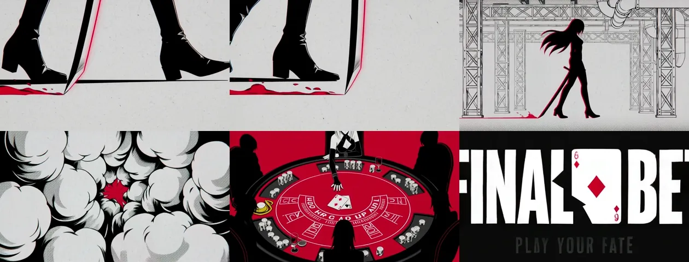

# 01 · FINAL BET —— 红黑白平面矢量动画 / 赌局



| | |
|---|---|
| 类型 | 平面矢量动画 · 日式角色 · 品牌片 |
| 验证状态 | **已验证**，15s / 1344×768 / 24fps / 单次生成 |
| 生成方式 | 文生视频 |
| 适用 | 游戏/App 概念片、赛事宣传、开场 title sequence |

## 成片观察

一条 15 秒 prompt 里塞了 11 个镜头，H3 全部还原，**包括结尾的 `FINAL BET`
标题卡文字**——这是最意外的一点，通常 AI 视频的画面文字都是乱码，
但在纯平面设计语境下、且文字是短英文单词时，H3 的成功率明显更高。

配色约束「只有正红、纯黑、纯白三色，无渐变」是整条 prompt 里最关键的一句。
去掉它，模型会自动补中间灰调，整个平面感就没了。

## 15 秒版本（单次生成，推荐先跑这个）

```
平面矢量动画风格，只有正红、纯黑、纯白三色，无渐变无中间色，粗黑轮廓线加网点半调质感，
日式动画角色造型结合瑞士平面设计构图，画面常被斜线切割成不规则色块。主题是一场赌上性命的赌局。

0-3s   黑色高跟靴踩过红色赌桌桌面，一条白色斜线把画面切成两块 [下摇]；
       切到白发红挑染的女子背对镜头，站在白底线稿管道城市中 [缓慢推进]。
3-6s   女子眼睛的横条特写占满画面中央，上下是纯黑色块 [固定镜头]；
       切到黑手套间红色扑克牌快速翻飞的切牌特写 [特写跟随]；
       切到红黑城市天际线剪影，白色天空一弯月 [固定镜头]。
6-9s   戴宽檐礼帽、白脸黑眼罩的男性反派正脸大特写，青色十字准星线扫过他的脸 [轻微推进]；
       切到俯视轮盘，白色圆心与黑色齿状边缘旋转 [俯拍旋转]；
       切到红白棋盘格背景前，白发女子坐在赌桌后指尖压着筹码 [缓慢拉远]。
9-12s  快闪蒙太奇，每个画面停留不超过 0.4 秒：瞳孔大特写内映出红色方块、
       白色赌场人群剪影、飞出的扑克牌、举牌的手、礼帽男按下筹码、斜切分屏对峙 [快速硬切]。
12-15s 全部人物剪影在红色背景中定格，白色扑克牌从画面上方缓缓落下 [固定镜头]；
       牌落地瞬间画面转全黑，白色粗体大字 FINAL BET 分两行浮现，
       红色方块符号嵌在字中间，下方细体小字 PLAY YOUR FATE [固定镜头]。

音频：低频心跳开场，筹码相撞的清脆声、切牌声、轮盘滚珠声依次进入，
鼓点在 9 秒后加密到最密，12 秒处全部音效骤停，只留一声低沉贝斯，然后静音。

不要出现：渐变色、中间灰调、多余的手指、变形面部、除 FINAL BET 与
PLAY YOUR FATE 之外的任何文字。
```

## 29 秒版本（5 段 · 6+6+6+6+5）

节奏更松，快闪段可以铺得更满。把上面的 5 个时间块各自扩写成一段独立 prompt，
每段开头**原样重复风格锚点那一整句**，然后：

| 段 | 时长 | 内容 |
|---|---|---|
| A | 6 | 高跟靴踩桌 + 线稿城市登场 |
| B | 6 | 眼睛特写 + 切牌 + 城市剪影 |
| C | 6 | 反派正脸 + 轮盘 + 荷官落座 |
| D | 6 | 快闪蒙太奇（加入 `FINAL ROUND` / `RISK / REWARD` 红底白字标签条） |
| E | 5 | 定格 + 落牌 + 标题卡 |

接力：A→E 每段尾帧作下段 `first_frame`；A 段成片作 `reference_video` 传给
B–E，锁住线条粗细和配色。

## API 参数

```json
{
  "model": "MiniMax-H3",
  "content": [{"type": "text", "text": "<上面的 prompt>"}],
  "duration": 15,
  "resolution": "2K",
  "ratio": "16:9"
}
```

## 已知坑

- 「青色十字准星」是整条 prompt 里唯一的第四种颜色，模型偶尔会把它铺开
  影响全局配色。想稳一点就删掉，改成白色准星。
- 快闪段如果写「每个画面停留不超过 0.2 秒」，模型会理解成运动模糊而不是硬切。
  0.4 秒是实测比较稳的下限。
- 标题卡文字超过两个单词后乱码率显著上升。长标题建议后期加。
