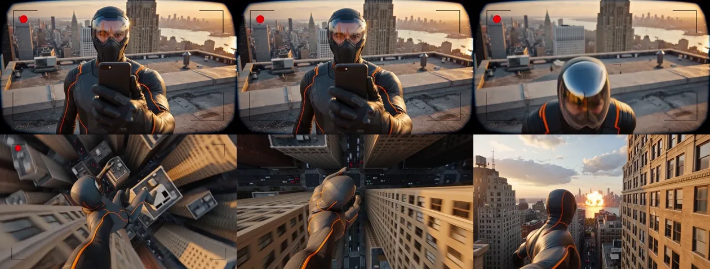

# 02 · 第一人称手持超英 vlog —— 电影质感



| | |
|---|---|
| 类型 | 电影质感真人实拍 · 第一人称 · 伪 UGC |
| 验证状态 | **已验证**，15s / 1344×768 / 24fps / 单次生成 |
| 生成方式 | 文生视频（建议配 `reference_image` 锁角色） |
| 适用 | 短视频钩子、游戏预告、品牌 campaign |

## 成片观察

这条片子的技术核心不是角色，是**「手机自拍取景框 UI + 电影级动态范围 + 日落逆光」
这套组合**。取景框和红色录制点让观众下意识把它读成真实拍摄的素材，
后半段取景框消失转客观镜头，落差感就是钩子。

实测 H3 对「画面左上角有红色录制圆点和圆角取景框 UI」的理解非常准确，
录制点还会自己闪烁。俯冲段的建筑透视变形也处理得比预期好。

角色是自创设定——深色机能战术服 + 橙色描边 + 全覆式反光护目面罩。
这个设定既避开了商业 IP，橙色描边在城市日落场景里的辨识度也够高。

## 15 秒版本（单次生成）

```
电影质感真人实拍，16:9，35mm 胶片颗粒，浅景深，日落逆光，橙金色高光配深蓝阴影，
高动态范围。主角是一名穿深灰与炭黑机能战术服、服装接缝有橙色描边、
戴全覆式反光护目面罩的都市守护者。

0-5s   第一人称自拍视角：他一只手臂伸出握着手机，脸占画面中央偏右，
       背后是高楼林立的城市与橙金色夕阳，天台碎石地面在下方 [手持轻微晃动]。
       画面左上角有闪烁的红色录制圆点和圆角取景框 UI。他对着镜头说话，
       然后转头看向远方。
5-10s  他把手机翻转向下，镜头随之俯拍脚下几百米的街道，随后他纵身跃出天台，
       镜头跟着一起坠落，两侧高楼向上飞速掠过，透视剧烈变形 [垂直跟拍下坠]。
10-15s 下坠中他侧头看向远处，一栋写字楼在城市另一端爆炸，橙红火球与黑烟腾起，
       火光映在他的护目面罩上 [手持跟随]；最后画面稳住，
       他半跪在另一栋楼的天台边缘，背对镜头看着远处的火光 [缓慢拉远]。

音频：风声极大，麦克风被风吹到破音，男声自言自语，远处车流；
5 秒后风噪骤然加剧，急促呼吸；10 秒处爆炸低频冲击波，随后警笛由远及近。

不要出现：多余肢体、变形的手、画面内的字幕文字、任何品牌标识。
```

## 29 秒版本（3 段 · 10+10+9）

| 段 | 时长 | 内容 | 接力 |
|---|---|---|---|
| A | 10 | 天台自拍 + 城市日落 + 转头看远方 | 尾帧 → B |
| B | 10 | 爆炸 + 天台奔跑 + 跃下 + 贴着着火幕墙俯冲 | 尾帧 → C |
| C | 9 | 火场匍匐 + 消防车救援现场 + 夜晚天台独坐拉远 | — |

三段共用同一组 `reference_image`（角色定妆图 3 张：正面、侧面、面罩特写）。
风格锚点那一整段在每段开头原样重写。

## API 参数

```json
{
  "model": "MiniMax-H3",
  "content": [
    {"type": "text", "text": "<prompt>"},
    {"type": "image_url", "image_url": {"url": "<角色定妆图1>"}, "role": "reference_image"},
    {"type": "image_url", "image_url": {"url": "<角色定妆图2>"}, "role": "reference_image"}
  ],
  "duration": 15,
  "resolution": "2K"
}
```

## 已知坑

- 不写「橙色描边」这类具体差异化特征，模型很容易滑向某个知名红蓝配色的
  商业 IP 角色。差异化特征要具体到颜色和位置。
- 「取景框 UI」在后半段应该消失，但模型有时会全程保留。想要落差感的话，
  在负面约束里补一句「10 秒后不再出现任何 UI 元素」。
- 俯冲镜头时长超过 6 秒，建筑会开始出现结构崩坏。控制在 5 秒内。
