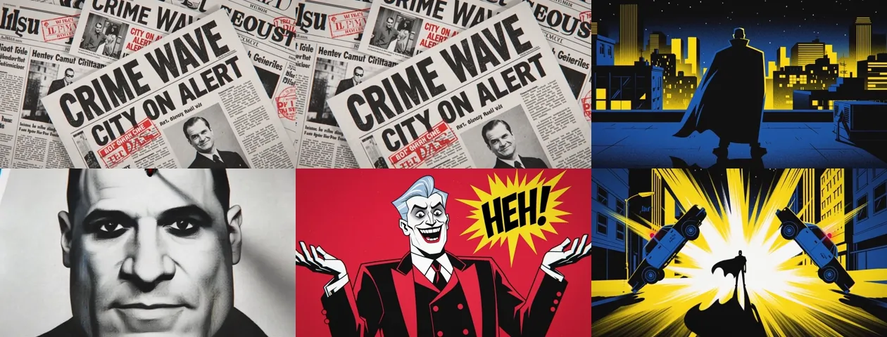

# 03 · NIGHT —— 美式硬派漫画 motion comic



| | |
|---|---|
| 类型 | 有限帧动画 · 漫画分镜 · 悬疑犯罪 |
| 验证状态 | **已验证**，15s / 1344×768 / 24fps / 单次生成 |
| 生成方式 | 文生视频 |
| 适用 | 有声漫画、剧集片头、悬疑内容开场 |

## 成片观察

核心手法是**「版面即画面」**：报纸拼贴、侦查板、六格分屏动作页——
这些本来是平面排版语言，被直接当成镜头用。这是它跟普通动画最大的区别，
也是最好复现的部分，因为每一个「版面」都是静态构图 + 轻微运镜就能成立。

配色定死午夜蓝 + 纯黑 + 铬黄 + 警灯红四色。25fps 的滞涩感在 H3 上不能直接
指定帧率，只能靠「有限帧动画质感」这句描述去逼近，实际输出仍是 24fps 平滑动画，
**要真正的滞涩感需要后期抽帧**（见下方）。

## 15 秒版本（单次生成）

```
美式硬派漫画分镜风格，午夜蓝、纯黑、铬黄、警灯红四色为主，粗黑描边加网点阴影，
有限帧动画的滞涩质感，画面常被不规则斜线切割成漫画格。主题是一座犯罪之城的午夜。

0-3s   一整版黑白报纸拼贴铺满桌面，头条大字 CRIME WAVE 与 CITY ON ALERT，
       红色印章戳在其上 [俯拍缓慢推进]。
3-6s   画面被两条不规则斜线切成三格，格中是一名深蓝斗篷、铬黄描边、
       面罩只露白色眼缝的夜行者，站在楼顶剪影中，斗篷被风掀起 [格与格依次点亮]。
6-9s   侦查板特写：城市地图上贴满照片、指纹卡与时间戳标签，红色毛线连成一张网 [横移扫过]；
       切到黑场中一部手机悬浮，四道红色射线交叉击中屏幕 [固定镜头]。
9-12s  街道爆炸，漫画式黄白放射状爆炸线，两辆警车被掀起，
       夜行者剪影站在爆炸正中 [固定镜头轻微震动]；
       切到空荡的午夜街道，一道极长的斗篷投影斜切整个画面 [缓慢下摇]。
12-15s 六格动作分屏，每格约 0.5 秒依次亮起：白色眼缝特写、持枪剪影、警车、
       地铁车厢、大桥、腾空的车 [逐格硬切]；
       最后转午夜蓝底，白色粗体大字 NIGHT 从左侧推入，
       右侧是夜行者屈膝着地的剪影 [固定镜头]。

音频：翻纸声与打字机声开场，低沉大提琴；6 秒后加入电流杂音与警笛；
9 秒爆炸闷响；12 秒起鼓点渐强，最后一记重音后骤停。

不要出现：写实照片质感、渐变柔光、多余肢体、除 CRIME WAVE / CITY ON ALERT /
NIGHT 之外的可读文字。
```

## 做出真正的有限帧滞涩感

H3 只输出 24fps 平滑动画。要漫画特有的顿挫，生成后抽帧到 12fps 再补回 24：

```bash
ffmpeg -i out.mp4 -vf "fps=12,fps=24" -c:a copy out_choppy.mp4
```

## 29 秒版本（3 段 · 10+10+9）

| 段 | 时长 | 内容 |
|---|---|---|
| A | 10 | 报纸拼贴 + 斜切三格夜行者登场 |
| B | 10 | 侦查板 + 手机被击中 + 监控墙背影 + 街道爆炸 |
| C | 9 | 长投影空街 + 反派举杯 + 六格动作页 + NIGHT 标题卡 |

反派设定：穿酒红西装、面色苍白、梳背头的男人，坐在沙发上举杯，
背后一圈黑色剪影随从。

## 已知坑

- **反派设定容易踩雷。**「面色苍白 + 梳背头 + 酒红西装 + 咧嘴笑」这组特征
  在训练分布里高度指向某个知名商业 IP 反派，实测确实会画成那个样子。
  要避开就得主动加差异特征（换发色、去掉夸张笑容、改西装颜色），
  并在负面约束里明确排除。
- 「格与格依次点亮」这种排版级指令 H3 理解得不错，但格数超过 6 个会乱。
- 报纸上的正文小字必然是乱码。只保证头条大字可读，负面约束里别去管小字，
  管了反而会让模型把整版文字都放大。
